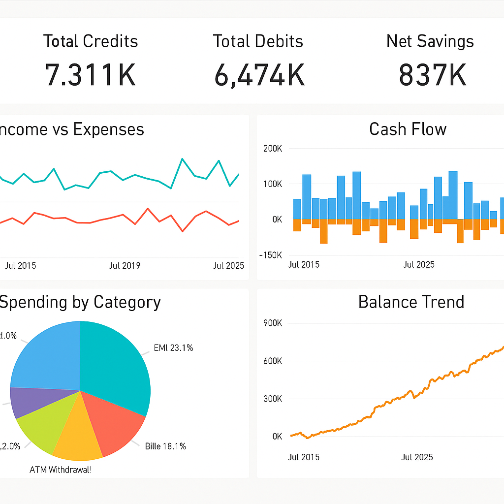

# 💳 HDFC Bank Financial Analysis (2015–2025)

This portfolio project showcases how to extract, clean, analyze, and visualize personal banking transactions using **Excel** and **Power BI**. The dataset used is a real bank statement from HDFC spanning 10 years.

## 📁 Project Structure

```
hdfc-bank-financial-analysis
│
├── 📄 README.md
├── 📊 Dataset
│   └── HDFC_Bank_Statement_Cleaned.xlsx
│
├── 📈 Reports
│   └── PowerBI_Screenshots
│       └── powerbi_dashboard.png
│
├── 📂 Scripts
│   └── Excel_Transformation_Steps.xlsx (manual steps in Excel)
```

## 🧹 Data Cleaning (Excel)
- Removed non-transaction rows
- Standardized date formats
- Split Debit/Credit into separate columns
- Derived Month, Year, and Category

## 📊 Financial Insights
- Total spend per category and month
- Debit/Credit trends
- Running account balance
- High-value outliers
- Net savings visualization

## 📈 Power BI Reports
The Power BI dashboard includes:
- KPI Cards
- Monthly Trends
- Category Pie Chart
- Debit vs Credit by Month
## Report Example


🔗 _For visual walkthrough, refer to the dashboard screenshots in `Reports/PowerBI_Screenshots/`_
